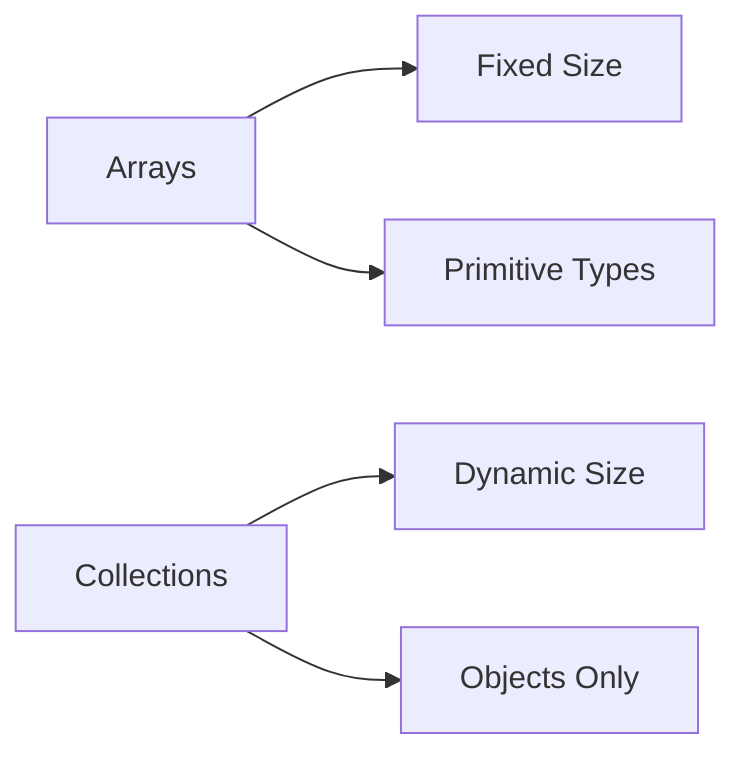

[](https://classroom.github.com/open-in-codespaces?assignment_repo_id=22568118)
# Java Collections Framework Lab

In this lab you will learn about various collection types in Java, their features, and how to implement them.

## Setup
Before you being the lab exercises below, fist create a new java package named `ie.atu.collections`. Use the `JAVA PROJECTS` pane inside the Explporer panel on the left to create this package. Inside this package create a class named `Main`. Insert the main method into this class and add a print statement. Run the code to test that everything works.  

## Agenda
1. [The Java Collections Framework](#1-the-java-collections-framework)
2. [Arrays vs Collections](#2-arrays-vs-collections)
3. [Iteration with Iterators](#3-iteration-with-iterators)
4. [ArrayList vs LinkedList](#4-arraylist-vs-linkedlist)
5. [Deleting Elements from a List](#5-deleting-elements-from-a-list)
6. [Finding the Number of Elements in a List](#6-finding-the-number-of-elements-in-a-list)
7. [Creating and Storing Custom Objects with Classes](#7-creating-and-storing-custom-objects-with-classes)

---

## 1. The Java Collections Framework

The Java Collections Framework (JCF) is a set of classes and interfaces that implement reusable data structures, like lists and sets.

### Example

In this example, we create an `ArrayList` to store a list of names. We then add several names to the list and print out the entire list. This demonstrates how easy it is to create and manipulate a collection of elements using JCF.

We use `List<String>` to declare our list instead of `ArrayList<String>` because `List` is an interface, and it allows us to easily switch to a different implementation (like `LinkedList`) if needed in the future without changing much code. The angle brackets (`<>`) indicate that this is a generic type, which means it can hold elements of a specific type—in this case, `String`. Generics help us ensure type safety, meaning we can only add `String` elements to this list, preventing accidental addition of other data types.

```java
import java.util.ArrayList;
import java.util.List;

public class Main {
    public static void main(String[] args) {
        List<String> namesList = new ArrayList<>();
        namesList.add("Alice");
        namesList.add("Bob");
        namesList.add("Charlie");
        System.out.println(namesList);
    }
}
```

### DIY Exercise 🔦

- Create an `ArrayList` that stores integers  
- Add 3 integers to the ArrayList  
- Print the `ArrayList`

<details>
<summary>Expected Output</summary>

```
[1, 2, 3]
```

</details>

---

## 2. Arrays vs Collections

Arrays and Collections are both ways to group objects in Java, but they have key differences.

### Comparison Diagram



### Example

In the following example, we demonstrate the difference between using an array and a collection. We create an array of integers with a fixed size and also create an `ArrayList` that can dynamically grow as we add more elements.

```java
// Using an array
int[] numbers = {1, 2, 3, 4};

// Using a collection
List<Integer> numberList = new ArrayList<>();
for (int number : numbers) {
    numberList.add(number);
}

System.out.println(numberList);
```

### DIY Exercise 🔦

- Convert an array of strings to an `ArrayList` of strings. Instead of using the for loop above use the inbuilt `java.util.Arrays.asList` method. 
- Add an extra element to the `ArrayList`.  
- Print the `ArrayList`.

<details>
<summary>Expected Output</summary>

Assuming the original array is `["apple", "banana", "cherry"]` and the extra element is `"date"`, the expected output could be:

```
[apple, banana, cherry, date]
```

</details>

---

## 3. Iteration with Iterators

An `Iterator` is used to traverse through elements of a collection in Java. There are two main types of iterators available in the Java Collections Framework:

1. **`Iterator`**: The basic iterator that allows you to iterate forward through a collection.  
2. **`ListIterator`**: A more advanced iterator that is specifically used for `List` implementations. It allows bi-directional traversal (both forward and backward) and provides additional features like adding, modifying, or removing elements.

### Example - Basic Iterator

In this example, we create an `ArrayList` of names and use an `Iterator` to iterate through the list. The `Iterator` provides methods to check if more elements are available (`hasNext()`) and to access the next element (`next()`). This is useful for traversing collections in a standardized way.

```java
import java.util.ArrayList;
import java.util.Iterator;
import java.util.List;

public class BasicIteratorExample {
    public static void main(String[] args) {
        List<String> names = new ArrayList<>();
        names.add("Alice");
        names.add("Bob");
        names.add("Charlie");

        Iterator<String> iterator = names.iterator();
        while (iterator.hasNext()) {
            System.out.println(iterator.next());
        }
    }
}
```

### DIY Exercise 🔦

1. Create an `ArrayList` of your favorite colors and iterate through the list using an `Iterator`. Print each color in the list.

<details>
<summary>Expected Output (Example)</summary>

If your favorite colors are red, green, and blue, an expected output might be:

```
red
green
blue
```

</details>

2. Use a `ListIterator` to iterate over the same list of colors in both forward and backward directions. Try adding a new color using `ListIterator` at a specific position and replacing an existing color.

<details>
<summary>Expected Output (Example)</summary>

For instance, after adding "yellow" at index 1 and replacing "green" with "purple", the output might be:

```
Forward iteration:
red
yellow
purple
blue

Backward iteration:
blue
purple
yellow
red
```

</details>

---

## 4. ArrayList vs LinkedList

This section discusses the differences between `ArrayList` and `LinkedList` in Java.

### Explanation

- **ArrayList** is backed by an array and offers fast random access. However, inserting or deleting elements in the middle of the list can be slow due to the need to shift elements.
- **LinkedList** is implemented as a doubly linked list, which enables faster insertions and deletions in the middle of the list. However, random access is slower because it must traverse the list from the beginning.

### Example

The following code demonstrates basic operations on both an `ArrayList` and a `LinkedList`.

```java
import java.util.ArrayList;
import java.util.LinkedList;
import java.util.List;

public class ListComparison {
    public static void main(String[] args) {
        List<Integer> arrayList = new ArrayList<>();
        List<Integer> linkedList = new LinkedList<>();

        // Adding elements
        for (int i = 0; i < 10; i++) {
            arrayList.add(i);
            linkedList.add(i);
        }

        // Access random element
        System.out.println("ArrayList element at index 5: " + arrayList.get(5));

        // Insertion in the middle
        arrayList.add(5, 100);
        linkedList.add(5, 100);

        System.out.println("ArrayList after insertion: " + arrayList);
        System.out.println("LinkedList after insertion: " + linkedList);
    }
}
```

### DIY Exercise 🔦

- Create both an `ArrayList` and a `LinkedList` of strings.  
- Add several elements to both lists.  
- Time the performance of random access and mid-list insertions for each list.

<details>
<summary>Note</summary>

The output will include printed lists and timing information. The actual numbers may vary based on system performance.

</details>

---

## 5. Deleting Elements from a List

This section explains how to delete elements from a list in Java.

### Explanation

Elements can be deleted from a list in several ways:
- Using the `remove(Object o)` method to delete an element by value.
- Using the `remove(int index)` method to delete an element by its index.
- Using an `Iterator` to safely remove elements while iterating over the list.

### Example

Below is an example demonstrating these deletion methods:

```java
import java.util.ArrayList;
import java.util.Iterator;
import java.util.List;

public class ListDeletionExample {
    public static void main(String[] args) {
        List<String> names = new ArrayList<>();
        names.add("Alice");
        names.add("Bob");
        names.add("Charlie");
        names.add("David");

        // Remove by object
        names.remove("Bob");
        System.out.println("After removing Bob: " + names);

        // Remove by index
        names.remove(1); // This will remove the element at index 1
        System.out.println("After removing element at index 1: " + names);

        // Remove using Iterator
        Iterator<String> iterator = names.iterator();
        while (iterator.hasNext()) {
            String name = iterator.next();
            if (name.startsWith("D")) {
                iterator.remove();
            }
        }
        System.out.println("After iterator removal: " + names);
    }
}
```

### DIY Exercise 🔦

- Create an `ArrayList` of integers with several numbers.  
- Remove all even numbers using an iterator.  
- Print the updated list.

<details>
<summary>Expected Output (Example)</summary>

If the original list is `[1, 2, 3, 4, 5, 6]`, after removal the output might be:

```
[1, 3, 5]
```

</details>

---

## 6. Finding the Number of Elements in a List

This section demonstrates how to find the number of elements in a Java list.

### Explanation

The `size()` method of the `List` interface returns the number of elements in a list. This method is efficient and commonly used to determine list length.

### Example

Below is a simple example:

```java
import java.util.ArrayList;
import java.util.List;

public class ListSizeExample {
    public static void main(String[] args) {
        List<String> names = new ArrayList<>();
        names.add("Alice");
        names.add("Bob");
        names.add("Charlie");
        
        // Display the number of elements in the list
        System.out.println("Number of elements: " + names.size());
    }
}
```

### DIY Exercise 🔦

- Create a list of your favorite fruits.  
- After adding and removing some fruits, print the count of how many fruits remain in the list.

<details>
<summary>Expected Output (Example)</summary>

If after your operations the list contains `["apple", "mango", "grape"]`, the output would be:

```
Number of fruits: 3
```

</details>

---

## 7. Creating and Storing Custom Objects with Classes

In this section, we will explore how to create custom classes and store them in Java collections.

We will use a `Student` class with fields like `name` and `age`, and create instances of this class to store in an `ArrayList`. This class will also have a constructor, getter methods, setter methods, and a `toString()` method for convenient printing.

### Why Override `toString()` and equals() Methods?

In the `Student` class, we are overriding the `toString()` and `equals()` methods for several reasons:
1. **`toString()`**: Overriding `toString()` provides a meaningful string representation of the `Student` object, which is useful for debugging and logging purposes.
2. **`equals()`**: By default, the `equals()` method compares object references, meaning two different student objects with the same values would be considered unequal. Overriding `equals()` ensures that two `Student` objects with the same `name` and `age` are considered equal.

### Example - Creating a Student Class with Getters and Setters

```java
public class Student {
    private String name;
    private int age;

    // Constructor
    public Student(String name, int age) {
        this.name = name;
        this.age = age;
    }

    // Getters
    public String getName() {
        return name;
    }
    public int getAge() {
        return age;
    }

    // Setters
    public void setName(String name) {
        this.name = name;
    }
    public void setAge(int age) {
        this.age = age;
    }

    // Override toString() method
    @Override
    public String toString() {
        return "Student{name='" + name + "', age=" + age + "}";
    }

    // Override equals() method
    @Override
    public boolean equals(Object obj) {
        if (this == obj) return true;
        if (obj == null || getClass() != obj.getClass()) return false;
        Student student = (Student) obj;
        return age == student.age && name.equals(student.name);
    }
}
```

### Step 1: Using Classes in Collections

```java
import java.util.ArrayList;
import java.util.List;

public class CustomObjectExample {
    public static void main(String[] args) {
        // Create an ArrayList to hold Student objects
        List<Student> students = new ArrayList<>();

        // Adding new Student objects to the ArrayList
        students.add(new Student("Alice", 21));
        students.add(new Student("Bob", 19));
        students.add(new Student("Charlie", 22));

        // Display the list of students
        System.out.println("List of Students:");
        for (Student student : students) {
            System.out.println(student);
        }

        // Adding another student at index 1
        students.add(1, new Student("David", 20));
        System.out.println("\nAfter adding David at index 1:");
        for (Student student : students) {
            System.out.println(student);
        }

        // Removing a student by object (works with overridden equals method)
        students.remove(new Student("Charlie", 22));
        System.out.println("\nAfter removing Charlie:");
        for (Student student : students) {
            System.out.println(student);
        }
    }
}
```

### Step 2: Understanding Classes in Collections

1. **Adding Custom Objects**: We created a list of `Student` objects and added them using the `add()` method, similar to adding primitive types.  
2. **Using Setters in Classes**: The `Student` class allows modification of fields using setters, providing flexibility for mutable objects.

### DIY Exercise 🔦

1. Create a `Book` class with attributes `title`, `author`, and `price`, including getters, setters, and a `toString()` method.  
2. Create an `ArrayList` of `Book` objects and add several books to the list.  
3. Try to:  
   - Insert a book at a specific position in the list.  
   - Remove a book by object.  
   - Iterate through the list and print out the details of each book.

<details>
<summary>Expected Output (Example)</summary>

A sample output might look like:

```
List of Books:
Book{title='1984', author='George Orwell', price=19.99}
Book{title='Brave New World', author='Aldous Huxley', price=15.50}
Book{title='Fahrenheit 451', author='Ray Bradbury', price=12.75}

After insertion and removal:
Book{title='1984', author='George Orwell', price=19.99}
Book{title='The Handmaid's Tale', author='Margaret Atwood', price=14.99}
Book{title='Fahrenheit 451', author='Ray Bradbury', price=12.75}
```

</details>

---

That's the end of this lab! Practice these exercises to master Java Collections and learn how custom classes can simplify your code. Use the examples and DIY exercises to further explore and understand how different collection classes work.
